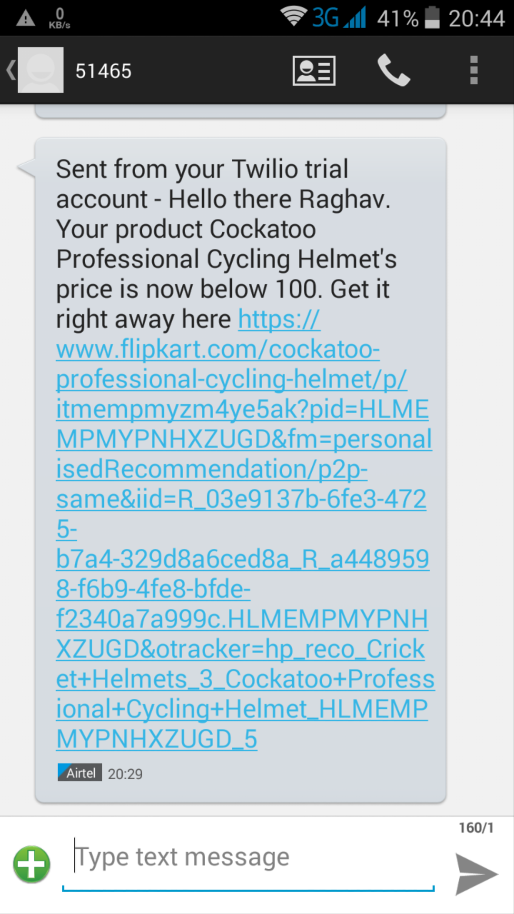

# Shotgun

An application developed using Ruby on Rails to monitor the price of a particular item in Flipkart every minute by using a CRON job and reporting a message to the user when the price of the item falls below a particular threshold specified by the user. It notifies the user using the using Twilio message service.

## Working

Multiple users can create an account here and specify as many products they want. The user enters the flipkart link of the product and the target of the product. The application will interact with the Flipkart API and get the details of the product. The homepage will display all the products the user wants to call Shotgun on. On selecting a particular product, it will display the product details, a table with the price of the product and the time, a graph plotted between the time and the price of the product. The user can also do basic operations like create, read, update and delete. The application checks the price of the product every minute (you can change this) by running a cron task. If the current price of the product is below the target price specified by the user, it sends a message to the user by using the Twilio message service along with the link of the product that the user wants to buy.

## Requirements

* A Laptop with Ubuntu / Linux (as cron jobs only work on Linux) with Internet connection
* Install Ruby 2.3.4
* Install Rails 5.0.1
* A Twilio Account with the Twilio id and password which should be added in a .env file
* Modify the seeds file to your Twilio verified phone number and user name
* Access to the Flipkart API. Also change the .env file with the Flipkart API credentials

## Working


As of now, this application is open-source and anyone can use this by cloning the repository.
Once all the requirements are satisfied, go to the project location and run the following commands in the terminal.

First make sure that Ruby and Rails are installed properly by running

```
ruby -v
rails -v
```

Once Ruby and Rails are installed properly in your laptop, run the following commands to setup the app

Run
```
bundle install
```
to install the gems that are required

After that, run the following commands

```
rails db:create
rails db:migrate
rails db:seed
```

Now, to make the cron job to run every minute, run the following commands.

```
whenever
whenever --update-crontab
sudo service cron restart
crontab
```
You can change to duration of the cron tasks in the schedule.rb file and run the cron again by running the commands given above.

With everything set, it's time to start the server. The server can be started using the command

```
rails s
``` 

in the terminal. Once the server is running, go the browser and hit the url "localhost:3000". This would load the web page and you are good to go!


## Application walkthrough

### Sign up


### Log in


### Adding a new product


### Homepage with all the user's products


### Product detail page of a particular product


### The time vs price graph of a particular product


### Text message with the Flipkart link sent to the user's mobile phone when the price of the product falls below the target price




Your call for Shotgun is just a click away!
